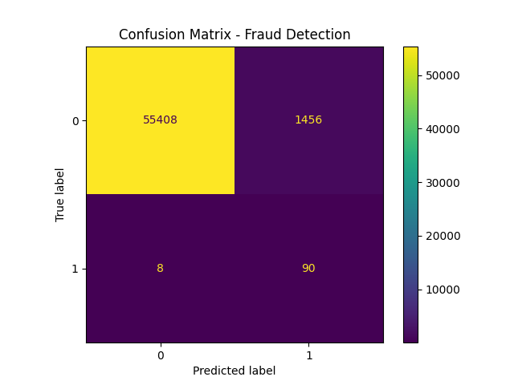
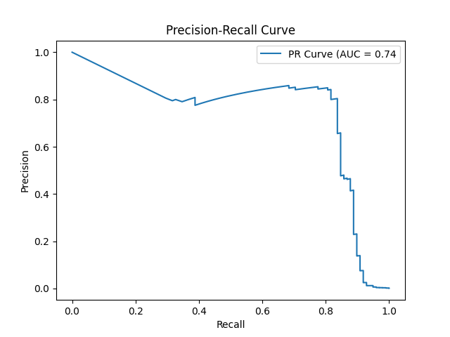

# Credit Card Fraud Detection (Logistic Regression)

Logistic regression fraud detection project using Python (pandas, numpy, scikit-learn).

## Overview

This project builds a fraud detection model using logistic regression on a highly imbalanced dataset of credit card transactions.
The objective is to identify fraudulent transactions while minimizing missed fraud cases, which are critical from a business perspective.

## Dataset Description

The dataset used in this project is the **Credit Card Fraud Detection dataset** available on Kaggle:
https://www.kaggle.com/datasets/mlg-ulb/creditcardfraud
It contains 284,807 transactions made by European cardholders, with fraud cases accounting for approximately 0.17% of the dataset.
Due to confidentiality, most features (`V1`–`V28`) are the result of a PCA transformation and are already standardized.

### Key Features

- `Amount`: transaction amount  
  - Continuous variable representing the monetary value of each transaction  
  - Highly right-skewed, with a small number of large transactions  
  - Log transformation was applied to reduce skewness and improve model performance  

- `Time`: seconds elapsed between transactions  
  - Represents the time since the first transaction in the dataset  
  - Does not directly correspond to real-world timestamps (e.g., hour of day)  
  - Tested for predictive value, but showed no significant impact on model performance  

- `Class`: target variable  
  - 0 = non-fraud  
  - 1 = fraud  

The dataset is widely used as a benchmark for fraud detection models in machine learning.

## Key Challenges

- Severe **class imbalance**
- Highly **skewed distribution** of transaction amounts
- Need to balance **fraud detection (recall)** vs **false positives (precision)**

## Handling Class Imbalance

The dataset is highly imbalanced, with fraud cases representing approximately 0.17% of all observations. To address this, the parameter `class_weight="balanced"` was used in the logistic regression model.
This approach automatically assigns higher importance to the minority class. In this dataset, a fraud observation is weighted approximately 300 times more than a non-fraud observation during training.
As a result, the model is penalized much more heavily for misclassifying fraud cases, encouraging it to focus on detecting the minority class and improving recall.

## Log Transformation of Amount

The `Amount` feature exhibits a highly right-skewed distribution, with a small number of transactions having significantly larger values than the majority. To address this, a logarithmic transformation (`log1p`) was applied to reduce skewness and compress extreme values. This transformation makes the relationship between the feature and the log-odds of the target variable more linear, which aligns with the assumptions of logistic regression. As a result, the model becomes more stable and better able to capture meaningful patterns in the data.

## Train/Test Split with Stratification

The dataset was split into training and test sets using stratification to ensure that both subsets preserve the original class distribution. This is particularly important in highly imbalanced datasets, as it prevents situations where the test set contains too few fraud cases, which would lead to unreliable model evaluation.

## Regularization Tuning

The regularization strength of the model was tuned by optimizing the hyperparameter `C` using GridSearchCV. Cross-validation was applied to evaluate different values of `C` and select the best-performing model. This process helps control overfitting and improves the model’s ability to generalize to unseen data.

## Optimization Objective

The model was optimized using recall as the primary evaluation metric. This choice reflects the business objective of fraud detection, where failing to detect a fraudulent transaction (false negative) is significantly more costly than incorrectly flagging a legitimate transaction (false positive).

## Key Results

The model achieved a recall of 0.92 for the fraud class, successfully identifying the majority of fraudulent transactions. However, precision was relatively low at 0.06, indicating that many non-fraud transactions were incorrectly flagged as fraud.

The F1-score for the fraud class was 0.11, reflecting the trade-off between high recall and low precision. Overall accuracy reached 0.97, but this metric is not reliable in this context due to the strong class imbalance.

The model achieved a ROC-AUC score of 0.97, indicating strong overall discrimination between fraudulent and non-fraudulent transactions.

In absolute terms, out of 98 fraud cases in the test set, the model correctly identified approximately 90 of them, but at the cost of generating a large number of false positives among the 56,864 non-fraud transactions.

These results highlight a recall-focused model that prioritizes minimizing missed fraud cases, while leaving room for improvement in reducing false positives through techniques such as threshold tuning.

## Confusion Matrix

The confusion matrix shows that while the model successfully detects most fraud cases, it generates a high number of false positives. This reflects the recall-focused optimization strategy, where minimizing missed fraud cases is prioritized over reducing false alerts.

## Precision–Recall Curve

The precision–recall curve provides a more informative view of model performance in imbalanced datasets. It shows how precision decreases as recall increases, highlighting the trade-off between detecting fraud cases and minimizing false positives.
In this model, recall remains high while precision drops significantly, confirming that the model prioritizes detecting fraudulent transactions at the cost of generating false alerts.

## Limitations
The model’s low precision may result in a high number of false positives, which could impact operational efficiency. Threshold optimization was not implemented, which could help improve the precision-recall balance.
Additionally, the use of PCA-transformed features limits interpretability, as the original meaning of variables is not directly accessible. Logistic regression may also struggle to capture more complex non-linear relationships present in the data.
Finally, while the `Time` feature was retained in the model, it was not scaled or transformed. Given that logistic regression can be sensitive to feature magnitudes, this may introduce minor inconsistencies in how the model weights this variable, even though it did not show a significant impact on overall performance.

